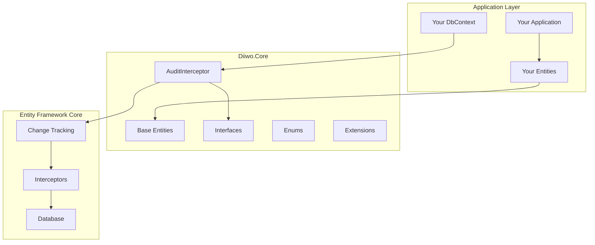
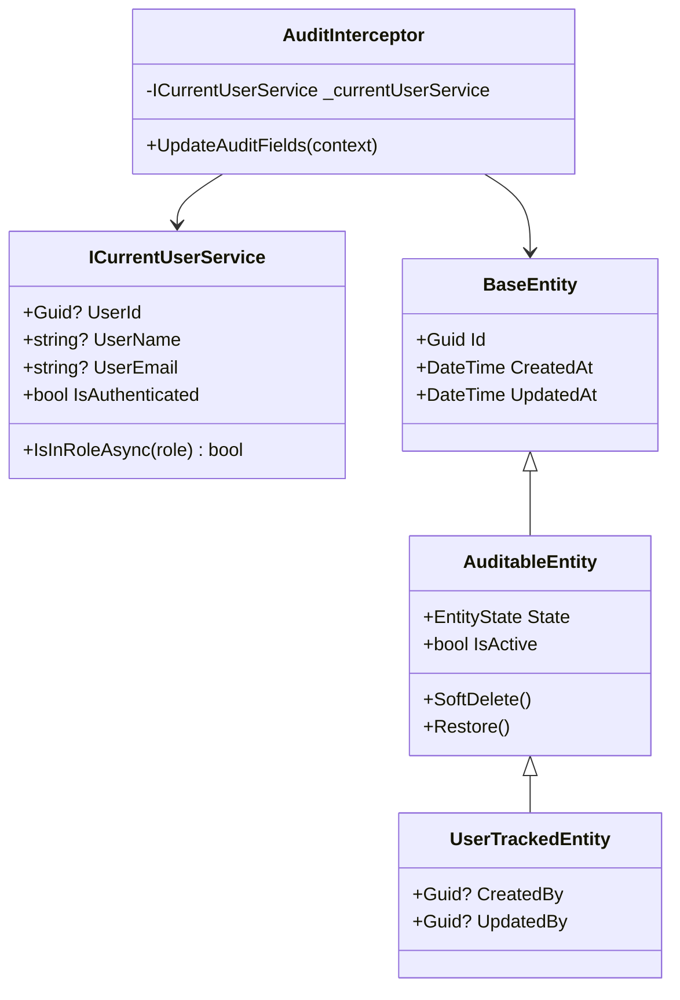
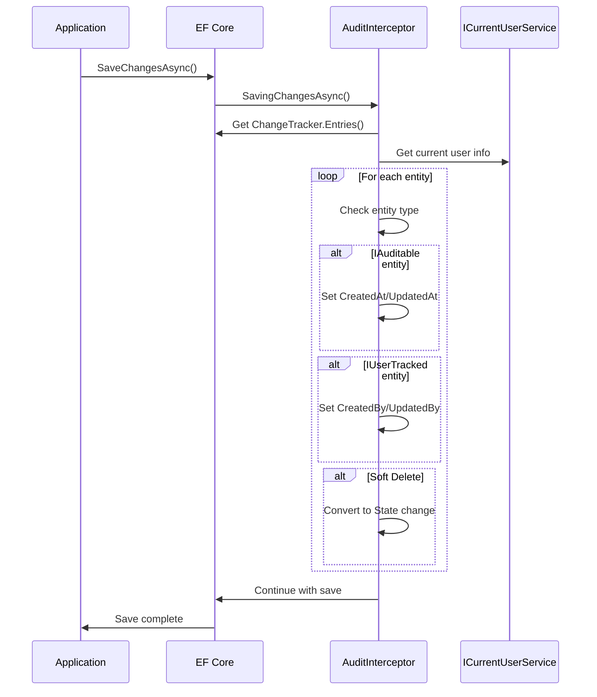
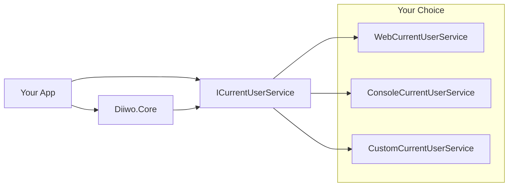
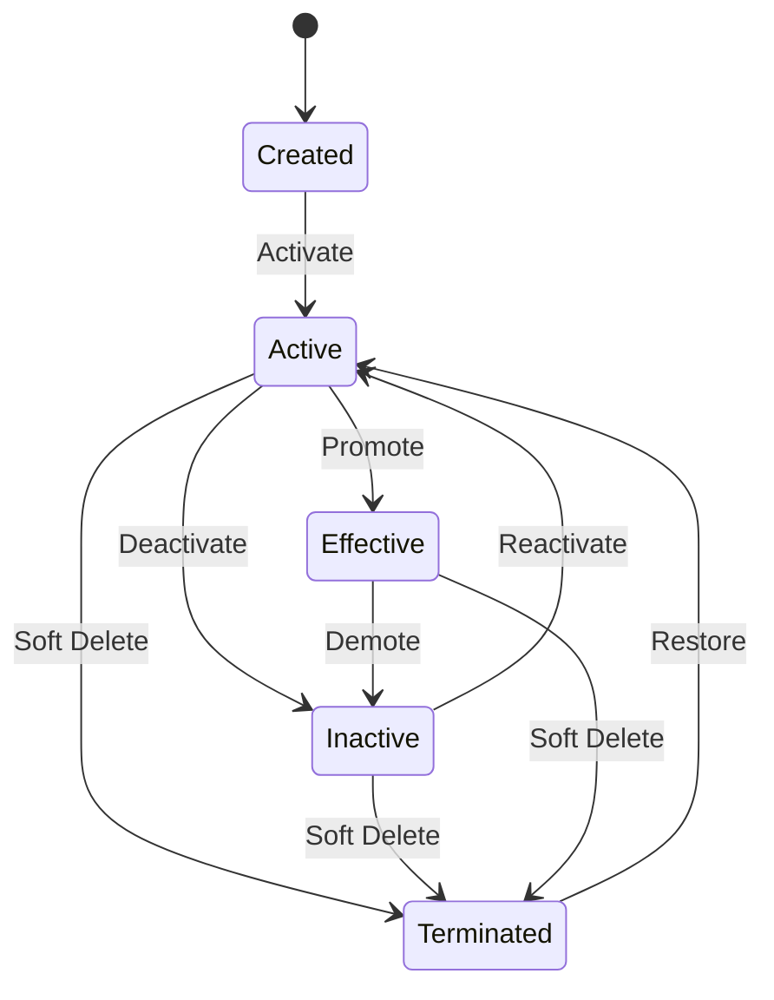

# Diiwo.Core Architecture Guide

This document explains the architectural decisions, design patterns, and principles behind **Diiwo.Core**.

## 🎯 Design Philosophy

### Core Principles

1. **Universal Applicability** - Works across all .NET application types
2. **Framework Agnostic** - No dependencies on specific web or UI frameworks
3. **Minimal Dependencies** - Only essential packages to maximize compatibility
4. **Clean Architecture** - Follows DDD and clean architecture principles
5. **Performance First** - Zero runtime overhead, EF Core optimized
6. **Developer Experience** - Simple to use, hard to misuse

### Design Goals

- ✅ **Plug and Play** - Add to any existing project without breaking changes
- ✅ **Convention over Configuration** - Works out of the box with minimal setup
- ✅ **Extensible** - Easy to customize and extend for specific needs
- ✅ **Testable** - All components are easily unit and integration testable
- ✅ **Maintainable** - Clear separation of concerns and responsibilities

## 🏗️ Architecture Overview

### High-Level Architecture



### Component Diagram



## 📦 Package Structure

```
Diiwo.Core/
├── Domain/
│   ├── Entities/           # Base entity classes
│   │   ├── BaseEntity.cs
│   │   ├── AuditableEntity.cs
│   │   ├── UserTrackedEntity.cs
│   │   ├── DomainEntity.cs
│   │   └── UserOwnedEntity.cs
│   │
│   ├── Interfaces/         # Core interfaces
│   │   └── ICoreInterfaces.cs
│   │
│   └── Enums/             # Core enumerations
│       └── CoreEnums.cs
│
├── Interceptors/           # EF Core interceptors
│   └── AuditInterceptor.cs
│
└── Extensions/             # Service registration
    └── ServiceCollectionExtensions.cs
```

## 🎭 Entity Hierarchy Design

### Inheritance Strategy

We chose **Table Per Hierarchy (TPH)** as the primary strategy, but the design supports **Table Per Type (TPT)** as well:

```csharp
// Recommended: Each entity inherits from appropriate base
public class Product : AuditableEntity     // Gets audit + soft delete
public class Order : UserTrackedEntity     // Gets audit + soft delete + user tracking  
public class Document : UserOwnedEntity    // Gets all above + ownership
```

### Why This Hierarchy?

1. **Composition Over Deep Inheritance** - Only 3-4 levels maximum
2. **Opt-in Complexity** - Choose the right base for your needs
3. **Interface Segregation** - Each level adds specific interfaces
4. **Database Flexibility** - Works with any EF Core table strategy

### Entity Responsibilities

| Entity | Responsibility | Use Cases |
|--------|---------------|-----------|
| `BaseEntity` | Basic identity and timestamps | Simple lookup tables, configurations |
| `AuditableEntity` | + State management, soft delete | Most business entities |
| `UserTrackedEntity` | + User audit trail | Entities requiring accountability |
| `DomainEntity` | + Domain logic placeholder | Rich domain models |
| `UserOwnedEntity` | + Multi-tenant ownership | User-specific data |

## 🔄 Audit Interceptor Design

### Why Interceptors Over Other Approaches?

| Approach | Pros | Cons | Decision |
|----------|------|------|--------|
| **SaveChanges Override** | Simple | Requires base DbContext | ❌ Too restrictive |
| **Entity Configuration** | Type-safe | Verbose, repetitive | ❌ Poor DX |
| **EF Interceptors** | Clean, automatic | EF Core only | ✅ **Chosen** |
| **Domain Events** | Very clean | Complex setup | ❌ Overkill |

### Interceptor Flow



### Performance Considerations

- **No N+1 Queries** - All audit updates happen in memory
- **Minimal Overhead** - Only processes changed entities
- **Batch Friendly** - Works efficiently with bulk operations
- **Change Tracking Aware** - Leverages EF Core's change detection

## 🔌 Dependency Injection Design

### Why No Default CurrentUserService?

**Problem**: Different application types need different implementations:
- Web apps → HttpContext
- Console apps → System user
- Desktop apps → Windows user
- Services → Configuration-based

**Solution**: Interface-first design with flexible registration:

```csharp
// Force explicit registration
services.AddDiiwoCore<WebCurrentUserService>();

// Or bring your own
services.AddScoped<ICurrentUserService, MyCustomService>();
services.AddDiiwoCoreWithExistingUserService();
```

### Dependency Strategy



## 🗃️ State Management Design

### Entity States

```csharp
public enum EntityState
{
    Created = 0,    // Just created, may need activation
    Inactive = 1,   // Temporarily disabled
    Active = 2,     // Normal operational state  
    Effective = 3,  // Fully operational with all features
    Terminated = 4  // Soft deleted
}
```

### State Transition Rules



### Why These States?

- **Created**: Handles entities that need approval/activation
- **Inactive**: Temporary disabling without data loss
- **Active**: Standard operational state
- **Effective**: Full operational state (e.g., published content)
- **Terminated**: Soft delete with potential recovery

## 🔒 Access Control via State Management

### State-Based Access Control

Instead of explicit locking, **Diiwo.Core** uses entity states to control access:

```csharp
// In your business logic
public async Task<Result> UpdateProduct(Guid id, ProductDto dto)
{
    var product = await _context.Products.FindAsync(id);

    // Check entity state before business logic
    if (product.State == EntityState.Terminated)
        return Result.NotFound("Product not found");

    if (product.State == EntityState.Inactive)
        return Result.Forbidden("Product is inactive");

    // Proceed with update...
}
```

### State-Based Access Patterns

| State | Access Level | Use Cases |
|-------|-------------|----------|
| `Active` | Full access | Normal operation |
| `Inactive` | Read-only or restricted | Temporarily disabled |
| `Terminated` | Hidden (soft deleted) | Audit preservation |
| `Effective` | Enhanced features | Premium/published content |

## 🏛️ Multi-Tenant Design

### UserOwnedEntity Pattern

```csharp
public abstract class UserOwnedEntity : UserTrackedEntity, IUserOwned
{
    public Guid? UserId { get; set; }
    
    public bool IsOwnedBy(Guid? userId) => UserId == userId || UserId == null;
    public bool IsGlobal => UserId == null;
}
```

### Tenant Isolation Strategies

1. **User-Owned**: Each record belongs to a specific user
2. **Global**: Shared records (UserId = null)
3. **Mixed**: Combination of both in same table

### Query Patterns

```csharp
// User's data only
.Where(x => x.UserId == currentUserId)

// User's data + global data
.Where(x => x.UserId == currentUserId || x.UserId == null)

// Global data only
.Where(x => x.UserId == null)
```

## ⚡ Performance Architecture

### Database Design Impact

```sql
-- Recommended indexes
CREATE INDEX IX_EntityName_State ON EntityName (State) WHERE State != 4; -- Exclude terminated
CREATE INDEX IX_EntityName_UserId ON EntityName (UserId) WHERE UserId IS NOT NULL; -- User data
CREATE INDEX IX_EntityName_UpdatedAt ON EntityName (UpdatedAt DESC); -- Recent changes
```

### Query Filter Implementation

```csharp
// Global query filter for soft deletes
protected override void OnModelCreating(ModelBuilder modelBuilder)
{
    foreach (var entityType in modelBuilder.Model.GetEntityTypes())
    {
        if (typeof(IAuditable).IsAssignableFrom(entityType.ClrType))
        {
            modelBuilder.Entity(entityType.ClrType)
                .HasQueryFilter(e => EF.Property<EntityState>(e, "State") != EntityState.Terminated);
        }
    }
}
```

### Memory Efficiency

- **Struct Enums** - `EntityState` is memory efficient
- **Nullable References** - Optional fields use nullable types
- **No Virtual Props** - Base entities avoid EF Core proxy overhead
- **Computed Properties** - `IsActive`, `FullName` etc. are computed, not stored

## 🧪 Testing Architecture

### Test Strategy

```csharp
// Unit tests focus on entity behavior
[Fact]
public void AuditableEntity_SoftDelete_SetsCorrectState()
{
    var entity = new TestEntity();
    entity.SoftDelete();
    Assert.Equal(EntityState.Terminated, entity.State);
}

// Integration tests focus on interceptor behavior  
[Fact]
public async Task SaveChanges_WithAuditInterceptor_SetsAuditFields()
{
    // Test actual database interaction
}
```

### Testability Features

- **Pure POCOs** - Entities are easily instantiable
- **Interface Abstraction** - `ICurrentUserService` easily mocked
- **In-Memory Database** - EF Core in-memory provider supported
- **Interceptor Isolation** - Can test with/without interceptor

## 🔮 Future Architecture Considerations

### Planned Enhancements

1. **Query Extensions**
   ```csharp
   context.Products.ActiveOnly()
   context.Orders.CreatedBy(userId)
   context.Documents.WithinDateRange(start, end)
   ```

2. **Event Sourcing Support**
   ```csharp
   public abstract class EventSourcedEntity : AuditableEntity
   {
       public List<DomainEvent> Events { get; private set; }
   }
   ```

3. **Caching Integration**
   ```csharp
   services.AddDiiwoCoreWithCaching<RedisCacheService>();
   ```

4. **Performance Monitoring**
   ```csharp
   services.AddDiiwoCoreWithTelemetry();
   ```

### Migration Strategy

All enhancements will be:
- **Backward Compatible** - No breaking changes
- **Opt-in** - Default behavior unchanged
- **Interface Driven** - New interfaces for new functionality

## 🤔 Design Decisions

### Why Guid IDs?

| Aspect | Guid | Int | Decision |
|--------|------|-----|----------|
| **Distributed Systems** | ✅ Perfect | ❌ Conflicts | **Guid** |
| **Performance** | ⚠️ Slightly slower | ✅ Fast | **Guid** (minimal impact) |
| **Security** | ✅ Non-guessable | ❌ Sequential | **Guid** |
| **Merging Data** | ✅ No conflicts | ❌ Requires mapping | **Guid** |

### Why DateTime for Timestamps?

| Aspect | DateTime | DateTimeOffset | Decision |
|--------|----------|----------------|----------|
| **Simplicity** | ✅ Simple | ⚠️ Complex | **DateTime** |
| **EF Core Support** | ✅ Full | ✅ Full | **DateTime** |
| **Global Apps** | ⚠️ Needs UTC | ✅ Perfect | **DateTime** (UTC convention) |

### Why Entity Interfaces?

```csharp
// Enables generic operations
public void SoftDeleteEntity<T>(T entity) where T : ISoftDeletable
{
    entity.State = EntityState.Terminated;
}

// Enables query extensions  
public static IQueryable<T> ActiveOnly<T>(this IQueryable<T> query) 
    where T : IAuditable
{
    return query.Where(x => x.IsActive);
}
```

## 📏 Architectural Constraints

### What We Don't Do

1. **Business Logic** - Pure infrastructure, no domain rules
2. **Validation** - Use FluentValidation or Data Annotations
3. **Authorization** - Use ASP.NET Core Identity or custom auth
4. **Caching** - Bring your own caching strategy
5. **Logging** - Use Microsoft.Extensions.Logging

### Compatibility Matrix

| Feature | .NET 6 | .NET 7 | .NET 8 | .NET 9 |
|---------|--------|--------|--------|--------|
| **Core Functionality** | ❌ | ❌ | ✅ | ✅ |
| **EF Core Version** | - | - | 8.0+ | 8.0+ |
| **C# Language** | - | - | 12+ | 12+ |

## 🔍 Code Quality

### Metrics

- **Cyclomatic Complexity**: < 10 per method
- **Test Coverage**: > 90%
- **Dependencies**: < 10 total
- **API Surface**: < 50 public members

### Standards

- **Nullable Reference Types**: Enabled
- **Code Analysis**: All rules enabled
- **XML Documentation**: 100% coverage
- **Semantic Versioning**: Strict adherence
- **Enterprise Ready**: Powers **Diiwo.Identity** production systems

---

## ❓ Architectural Questions?

For deeper architectural discussions:

- 💬 [GitHub Discussions](https://github.com/diiwo/diiwo-core/discussions)
- 📧 [Architecture Team](mailto:architecture@diiwo.com)
- 📖 [API Documentation](https://docs.diiwo.com/core/api)

---

*This document is updated with each major version to reflect architectural evolution.*